# Structure–Function Analysis of P-TEFb Transcription Regulation by HEXIM1 and HIV-1 Tat

**Affiliation:** CNRS / École Normale Supérieure – Institut de Biologie de l’ENS (IBENS), Département de Génomique Fonctionnelle  
**Period:** 2008–2012  
**Supervision:** Philippe Bensaude, CNRS UMR 8197  
**Thesis Title:** *Régulation du facteur d’élongation transcriptionnelle P-TEFb par les protéines HEXIM1 et TAT du VIH-1*  

---

## 🧭 Context
The P-TEFb complex (Cyclin T1/CDK9) is a central regulator of RNA polymerase II transcriptional elongation.  
Its activity is controlled by the **7SK RNP complex**, where **HEXIM1** acts as an inhibitory subunit, and hijacked by the **HIV-1 Tat** protein to promote viral gene expression.  

This thesis investigated the structural and functional interfaces involved in these interactions to elucidate the molecular mechanisms of transcriptional control.

---

## 🎯 Objectives
- Map the protein–protein interaction surfaces within the P-TEFb complex.  
- Characterize how HEXIM1 and HIV-1 Tat compete for Cyclin T1 binding.  
- Explore the impact of these interactions on transcriptional regulation in mammalian and model systems.  

---

## Project Overview

This research project focused on the **structural and functional dissection of P-TEFb regulation**, combining:

* **High-throughput yeast genetics (reverse two-hybrid)**
* **Mutagenesis of Cyclin T1 and HEXIM1**
* **Cell-based assays in human and mouse cells**
* **Fluorescence microscopy (localization, FLIP, single-molecule tracking)**
* **Biochemical assays (co-IP, CTD kinase assays)**
* **RNA level analyses (7SK detection, phylogeny, structural modeling)**
* **Comparative genomics and evolutionary reconstruction of 7SK RNA and its protein partners**

The core objective was to **map the interaction surfaces between Cyclin T1 (CycT1), CDK9, HEXIM1, LARP7**, and the **7SK snRNA**, and to understand how this regulatory module evolved across Metazoa.

## 🧪 Methods
- **Molecular biology:** Cloning, plasmid construction, and mutagenesis (site-directed PCR).  
- **Cell biology:** Establishment of stable transgenic cell lines and *C. elegans* models expressing labeled constructs.  
- **Protein analysis:** Co-immunoprecipitation, Western blotting, and two-hybrid screening (yeast).  
- **Microscopy:** Confocal imaging, FRET / FRAP / FLIP assays to measure protein dynamics.  
- **Biochemical assays:** RNA/DNA/protein extraction, immunodetection, quantitative analysis of transcriptional complexes.  

---

## 💡 Contributions
- Constructed mutant libraries of Cyclin T1 and HEXIM1 to identify contact regions with P-TEFb and Tat.  
- Mapped functional domains responsible for transcriptional activation or inhibition.  
- Combined biochemical and imaging approaches to establish a structure–function model of P-TEFb regulation.  
- Contributed to internal publications and collaborative manuscripts within the Bensaude group.  

---

## 📘 Key Skills
Molecular cloning · Protein interaction mapping · Transcriptional regulation · Confocal microscopy · Functional genomics  

---

## 🔗 Reference
Doctoral work conducted at the **Institut de Biologie de l’ENS**, CNRS UMR 8197 (Paris).  
Thesis defended in 2012: *Structure–function relationships in P-TEFb regulation by HEXIM1 and HIV-1 Tat*.


# **P-TEFb / HEXIM / 7SK — Interaction Mapping & Evolutionary Analysis**


---

## **Project Overview**

This repository summarizes a multi-year research project focused on the **structural and functional dissection of P-TEFb regulation**, combining:

* **High-throughput yeast genetics (reverse two-hybrid)**
* **Mutagenesis of Cyclin T1 and HEXIM1**
* **Cell-based assays in human and mouse cells**
* **Fluorescence microscopy (localization, FLIP, single-molecule tracking)**
* **Biochemical assays (co-IP, CTD kinase assays)**
* **RNA level analyses (7SK detection, phylogeny, structural modeling)**
* **Comparative genomics and evolutionary reconstruction of 7SK RNA and its protein partners**

The core objective was to **map the interaction surfaces between Cyclin T1 (CycT1), CDK9, HEXIM1, LARP7**, and the **7SK snRNA**, and to understand how this regulatory module evolved across Metazoa.

---


## **Experimental Strategy**

### **1 Large-scale random mutagenesis of Cyclin T1**

* **Error-prone PCR** of defined CycT1 subdomains
* **Recombination in yeast** to rebuild full-length BD-CycT1
* **Reverse two-hybrid selection** on 5-FOA
* Identification of **single amino-acid substitutions disrupting HEXIM1 interaction**

### **2 Targeted mutagenesis of HEXIM1**

* Alanine scanning of conserved motifs (basic region, PYNT motif, dimerization helix)
* Identification of **key aromatic residues** essential for Cyclin-binding (F262, F267, H275)

### **3 Two-hybrid validation pipeline**

* HEXIM1 interaction
* CDK9 binding control
* Mutant selection based on **Hexim(–) / Cdk9(++)** profiles

### **4 Cell-based validation**

* **Co-immunoprecipitation** (CycT1 mutants + endogenous HEXIM1 or CDK9)
* **CTD kinase assays** with/without RNAse
* **Reporter assays** (Gal4-CycT1 to recruit P-TEFb)
* **HIV Tat rescue assays in mouse 3T3 cells**

### **5 Microscopy**

* Subcellular localization of Cyclin T1 mutants
* FLIP experiments to quantify mobility
* Generation of **stable Dendra-CycT1 cell lines** for single-molecule tracking

### **6 Comparative genomics**

* Exhaustive search of **7SK RNA**, **HEXIM**, **LARP7**, **MePCE**
* Discovery of **functional 7SK RNA in nematodes** (C. elegans)
* Reconstruction of **secondary structure variants (M1–M8 helices)**
* Evidence for **ancient metazoan origin** of the 7SK-HEXIM system

---

## **Key Results**

### **1 Mapping the P-TEFb–HEXIM1 binding interface**

* Mutations disrupting HEXIM1 binding cluster along a **groove between the two cyclin folds**.
* The **central hotspot is residue Y175** of Cyclin T1.
* Y175 establishes a **π-hydrogen bond network** bridging helices H1–H2/H1’–H2’.

### **2 Overlap with HIV Tat binding**

* Y175 mutants **cannot bind Tat**
* → cannot support Tat-mediated HIV LTR activation
* → cannot bind TAR RNA
* → do not recruit P-TEFb to HIV promoter

### **3 HEXIM1 structural determinants**

* Three conserved aromatic residues (F262, F267, H275) are **essential for Cyclin T1 docking**.
* They occur in an **intrinsically disordered region**, similar to regions in other CDK regulators (p21, p27).

### **4 Cellular phenotypes**

* CycT1-Y175 mutants show:

  * Loss of HEXIM1 binding
  * Normal CDK9 binding
  * Increased CTD-kinase activity (insensitive to 7SK/HEXIM repression)
  * Enhanced transcription activation when tethered to DNA

### **5 Single-molecule mobility**

* C-terminal truncations of CycT affect:

  * RNAPII association
  * Nuclear mobility (measured by FLIP and photoactivation)

### **6 Evolutionary findings (MBE 2009)**

* 7SK/HEXIM system present across most Metazoa.
* **Two alternative structural conformations** of 7SK M2 region → potential RNA switch.
* Discovery and experimental validation of **functional 7SK homolog in C. elegans**.
* HEXIM and LARP7 underwent **lineage-specific duplications and losses** (HEXIM1/2 in mammals).

---

## **ExperimentalMethods Summary**

* **Yeast genetics**: standard 2-hybrid / reverse 2-hybrid
* **Molecular cloning**: mutagenesis, recombination
* **Cell culture**: HEK293T, 3T3, stable Dendra lines
* **Protein assays**: IP, co-IP, western blot
* **Kinase assays**: CTD4 phosphorylation
* **Microscopy**: confocal, FRAP/FLIP, single-molecule tracking

---

## **6. Project Pipeline**

```mermaid
flowchart TD

    %% Top of pipeline
    START[Experimental Strategy]

    %% Random mutagenesis
    START --> A[Random mutagenesis of Cyclin T1]
    A --> A1[Error-prone PCR on CycT1 subdomains]
    A1 --> A2[Yeast recombination to rebuild full-length BD-CycT1]
    A2 --> A3[Reverse two-hybrid selection on 5-FOA]
    A3 --> A4[Identification of single aa mutations disrupting HEXIM1 binding]

    %% Targeted mutagenesis
    A4 --> B[Targeted mutagenesis of HEXIM1]
    B --> B1[Alanine scanning of conserved regions]
    B1 --> B2[Identification of critical residues F262, F267, H275]

    %% Two-hybrid validation
    B2 --> C[Two-hybrid validation]
    C --> C1[HEXIM1 interaction assay]
    C1 --> C2[CDK9 binding assay]
    C2 --> C3[Selection of HEXIM negative / Cdk9 positive mutants]

    %% Cell-based validation
    C3 --> D[Cell-based validation]
    D --> D1[Co-immunoprecipitation with HEXIM1 or CDK9]
    D1 --> D2[CTD kinase assays with or without RNAse]
    D2 --> D3[Reporter activation using Gal4-CycT1]
    D3 --> D4[HIV Tat rescue assays in mouse cells]

    %% Microscopy
    D4 --> E[Microscopy]
    E --> E1[Subcellular localization]
    E1 --> E2[FLIP mobility quantification]
    E2 --> E3[Stable Dendra-CycT1 lines for single-molecule tracking]

    %% Comparative genomics
    E3 --> F[Comparative genomics]
    F --> F1[Search for 7SK RNA, HEXIM, LARP7, MePCE]
    F1 --> F2[Discovery of functional nematode 7SK RNA]
    F2 --> F3[Reconstruction of M1–M8 secondary structures]
    F3 --> F4[Inference of metazoan-wide evolutionary origin]

    %% Final integration
    F4 --> END[Integrated model of P-TEFb regulation]

```



## **7. Repository Structure**

```
PTEFb_HEXIM_project/
│
├── README.md
├── docs/
│   ├── figures/
│   │   ├── pipeline_mermaid.svg
│   │   ├── interaction_map.svg
│   │   └── 7SK_secondary_structure.png
│   ├── thesis_summary.pdf
│   ├── retrovirology_2014_summary.pdf
│   └── mbe_2009_summary.pdf
│
├── data/
│   ├── mutants_cyclinT1/
│   ├── yeast_screens/
│   ├── microscopy/
│   └── sequences_7SK_HEXIM/
│
├── scripts/
│   ├── analysis/
│   │   ├── rnabob_automaton.py
│   │   ├── sequence_alignment.sh
│   │   └── secondary_structure_viennaRNA.R
│   └── plotting/
│       └── visualize_mutations.ipynb
│
└── notebooks/
    ├── 01_mutagenesis_screen.ipynb
    ├── 02_coIP_and_kinase.ipynb
    ├── 03_microscopy_analysis.ipynb
    ├── 04_7SK_evolution.ipynb
    └── 05_summary_figures.ipynb
```

---

## **Publications**

* **N. Verstraete et al. (2014)**
  *A Cyclin T1 point mutation that abolishes P-TEFb binding to HEXIM1 and HIV Tat.* Retrovirology.

* **M. Marz, A. Donath, N. Verstraete et al. (2009)**
  *Evolution of 7SK RNA and its protein partners in Metazoa.* Mol Biol Evol.

---


