# ABM_NLC_CLL — Complete Computational Pipeline (NetLogo + OpenMOLE + Python)

## Overview

This repository provides a fully reproducible computational pipeline for the Agent-Based Model (ABM) of Nurse-Like Cell (NLC) and Chronic Lymphocytic Leukemia (CLL) interactions. It combines:

- **NetLogo** for the core biological simulation,
- **OpenMOLE** for large-scale parameter exploration and NSGA-II optimization,
- **Python** for analysis, validation, sensitivity exploration, and global parameter statistics.

The workflow reproduces the full computational process described in the study:

1. Define parameter ranges  
2. Run 20,000 OpenMOLE simulations  
3. Compute Pareto fronts  
4. Extract *best_via*, *knee-point*, and *best_conc* parameter sets  
5. Generate BehaviorSpace XML files  
6. Run NetLogo headless simulations  
7. Compare simulation outputs with experimental data  
8. Perform sensitivity analysis  
9. Generate PCA, violin plots, and statistical comparisons

Everything is automated through a Python CLI built with **Typer**.

---

# Repository Structure

```
ABM_NLC_CLL/
|
├── netlogo_model/
│   └── ABM_NLC_CLL.nlogo
|
├── openmole/
│   └── parameter_exploration.oms
|
├── abm_pipeline/
│   ├── cli.py
│   ├── config.py
│   │
│   ├── parameter_exploration/
│   ├── model_validation/
│   ├── sensitivity/
│   └── advanced_analysis/
|
├── data/
│   ├── patient_dict.txt
│   ├── experimental/
│   └── pareto/
|
├── results/
│   ├── behaviorspace/
│   ├── validation/
│   └── advanced_analysis/
|
└── README.md
```

---

# Installation

## Requirements

- Python ≥ 3.9  
- NetLogo 6.x  
- OpenMOLE ≥ 9.x  
- Git Bash (Windows users)

## Python installation

```
pip install -r requirements.txt
```

---

# NetLogo Model

The file `netlogo_model/ABM_NLC_CLL.nlogo` contains the complete ABM:

- CLL cells, monocytes, macrophages, NLCs  
- apoptosis, phagocytosis, signaling  
- spatial interactions and diffusion  
- state transitions and activation thresholds  

It provides both a graphical interface and a BehaviorSpace interface for headless runs. Reporter functions used in the pipeline include:

- `getViability`
- `getRemainingCellRatio`
- `getSeed`

---

# OpenMOLE Workflow

The workflow in `openmole/parameter_exploration.oms` defines:

- A `NetLogo6Task`  
- Exploration of 19 parameters  
- NSGA-II optimization with 20,000 simulations  
- Two objective functions (fitness on viability and concentration)  
- Filtering to retain parameter sets simulated at least 50 times  
- Generation of Pareto front tables and viable parameter sets  

These results are then used by the Python pipeline.

---

# Python Pipeline (CLI)

All pipeline steps are accessible via:

```
python -m abm_pipeline.cli --help
```

## 1. Aggregate OpenMOLE outputs

```
python -m abm_pipeline.cli aggregate INPUT_DIR output.txt
```

## 2. Build Pareto front

```
python -m abm_pipeline.cli pareto filtered_input.txt pareto_ABM_2D_PATIENT
```

## 3. Extract best parameter sets

```
python -m abm_pipeline.cli bestsets pareto_ABM_2D_PATIENT.txt best_param_sets_PATIENT.tsv
```

## 4. Generate BehaviorSpace parameter files

```
python -m abm_pipeline.cli make-behaviorspace best_param_sets_PAT.tsv params.txt --patient-dict patient_dict.txt
```

## 5. Generate NetLogo `.sh` scripts

```
python -m abm_pipeline.cli patient-shell .
```

This produces scripts such as:

```
patient_command_PATIENT.sh
```

## 6. Run simulations

```
bash patient_command_PATIENT.sh
```

## 7. Validate simulations

```
python -m abm_pipeline.cli plot-sim PATIENT stocha_knee_point
```

Figures are saved under:

```
results/validation/
```

## 8. Compute NRMSE tables for all patients

```
python -m abm_pipeline.cli validate-all .
```

This generates:

```
NRMSE_via_max_min.tsv
NRMSE_via_mean.tsv
NRMSE_conc_max_min.tsv
...
```

## 9. Sensitivity analysis

### Single parameter

```
python -m abm_pipeline.cli sensitivity-plot perturb-gui-apo-mov sensitivity_csv figures_sensitivity
```

### All parameters

```
python -m abm_pipeline.cli sensitivity-plot-all sensitivity_csv figures_sensitivity
```

## 10. Advanced Analysis

### Violin plots

```
python -m abm_pipeline.cli violin-all pareto/pareto_ABM_2D_all.tsv
```

### PCA

```
python -m abm_pipeline.cli pca pareto/pareto_ABM_2D_all.tsv
```

### Statistical tests

```
python -m abm_pipeline.cli stats_params pareto_class1.tsv pareto_class2.tsv
```

---

# Data Format

Each patient has:

```
data/experimental/PATIENT.csv
```

with columns:

```
Day (in hours)
PATIENT_viability
PATIENT_concentration
```

Simulation outputs are stored in:

```
results/behaviorspace/
```

Validation plots are stored in:

```
results/validation/
```

---

# Pipeline Summary

```mermaid
flowchart LR;
    A[Experimental Data] --> B[Patient-Specific Models];
    B --> C[OpenMOLE NSGA-II];
    C --> D[Pareto Fronts];
    D --> E[Extract Parameter Sets];
    E --> F[BehaviorSpace XML Generation];
    F --> G[NetLogo Headless Simulations];
    G --> H[Model Validation vs Experimental Data];
    H --> I[Sensitivity Analysis];
    I --> J[Advanced Parameter Analysis];
```



---

# Contact & Citation

If you use or adapt this pipeline, please cite the associated scientific publication and/or this repository.

---


