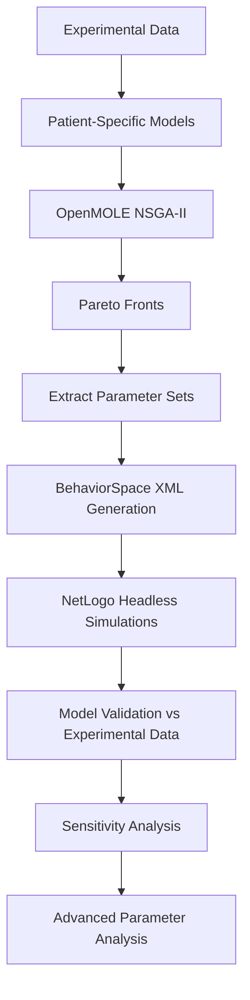

# ABM Parameter Exploration Pipeline

## 1. Overview

Ce dépôt contient les scripts utilisés pour l'exploration de l'espace de paramètres, l'optimisation NSGA-II (OpenMOLE), la sélection des sets de paramètres et la validation des modèles présentés dans l'article *An agent-based model of monocyte differentiation into tumour-associated macrophages in chronic lymphocytic leukemia*.

It combines:

- **NetLogo** for the core agent-based model (`netlogo_model/ABM_NLC_CLL.nlogo`)
- **OpenMOLE** for large-scale parameter exploration and multi-objective optimization (`openmole/parameter_exploration.oms`)
- **Python** for:
  - parsing and aggregating OpenMOLE outputs
  - building Pareto fronts and extracting best parameter sets
  - generating BehaviorSpace XML files for NetLogo
  - creating shell scripts for headless simulations
  - validating simulations against experimental data
  - running sensitivity analyses
  - performing PCA, violin plots and statistical tests on parameter distributions

All main steps are automated through the **`abm_pipeline`** Python package and a **Typer-based CLI**.

---

# Pipeline Summary



## 2. Repository Structure

At the top level:

```text
ABM_NLC_CLL/
|
├── netlogo_model/
│   └── ABM_NLC_CLL.nlogo          # NetLogo ABM
|
├── openmole/
│   └── parameter_exploration.oms  # OpenMOLE workflow (NSGA-II)
|
├── abm_pipeline/                  # Python package
│   ├── __init__.py
│   ├── cli.py                     # main CLI entrypoint
│   ├── config.py                  # patients, paths, constants
│   │
│   ├── parameter_exploration/
│   │   ├── __init__.py
│   │   ├── utils.py
│   │   │
│   │   ├── initial_ranges/
│   │   │   ├── __init__.py
│   │   │   └── aggregate_data.py          # aggregate OpenMOLE populations
│   │   │
│   │   ├── nsga2_analysis/
│   │   │   ├── __init__.py
│   │   │   ├── pareto_front.py            # build Pareto fronts
│   │   │   ├── extract_best_sets.py       # best_via, knee_point, best_conc
│   │   │   └── export_for_git.py          # reshape Pareto outputs
│   │   │
│   │   ├── instantiate_models/
│   │   │   ├── __init__.py
│   │   │   ├── behavior_space_files.py    # NetLogo param text files
│   │   │   └── xml_behavior_space.py      # BehaviorSpace XML generation
│   │   │
│   │   └── shell_commands/
│   │       ├── __init__.py
│   │       ├── patients.py                # patient_command_*.sh
│   │       ├── kneepoint.py              # kneepoint*_by_patient_*.sh
│   │       ├── averaged.py               # averaged class simulations
│   │       └── sensitivity.py            # sensitivity command scripts
│   │
│   ├── model_validation/
│   │   ├── __init__.py
│   │   ├── metrics.py            # RMSE / NRMSE / combined scores
│   │   ├── plots.py              # sim vs exp plots with scores
│   │   └── validator.py          # NRMSE tables for all patients
│   │
│   ├── sensitivity/
│   │   ├── __init__.py
│   │   ├── utils.py              # load sensitivity CSVs
│   │   └── plots.py              # sensitivity curves
│   │
│   └── advanced_analysis/
│       ├── __init__.py
│       ├── plots_advanced.py     # PCA, violin plots
│       ├── stats_advanced.py     # Mann–Whitney etc.
│       └── utils.py
|
├── data/
│   ├── patient_dict.txt          # mapping of patient metadata
│   ├── experimental/             # experimental CLL/NLC data per patient
│   └── pareto/                   # Pareto outputs and best sets
|
├── results/
│   ├── behaviorspace/            # NetLogo BehaviorSpace CSVs
│   ├── validation/               # sim vs exp figures, NRMSE tables
│   └── advanced_analysis/        # PCA plots, violin plots, stats
|
└── README.md
```

## 3. Installation requirements

- Python ≥ 3.9
- NetLogo 6.x
- OpenMOLE ≥ 9.x
- On Windows: Git Bash (to run .sh scripts)

## 4. NetLogo Model and OpenMOLE Workflow
### 1. NetLogo model

netlogo_model/ABM_NLC_CLL.nlogo implements:

- CLL cells, monocytes, macrophages, NLCs
- apoptosis, survival, phagocytosis
- signaling and polarization
- spatial movement and sensing
- reporters: getViability, getRemainingCellRatio, getSeed

The model provides:
- a GUI for interactive runs,
- a BehaviorSpace-compatible interface for headless runs.

### 2. OpenMOLE workflow

openmole/parameter_exploration.oms defines:
- a NetLogo6Task wrapping ABM_NLC_CLL.nlogo
- 19 parameters to explore
- NSGA-II optimization with ~20,000 simulations
- two objectives: viability fitness, concentration fitness
- filters to retain parameter sets simulated at least 50 times
- export of Pareto fronts and parameter sets per patient

OpenMOLE writes population and Pareto data, which are then parsed by the Python pipeline.

## 5. End-to-End Pipeline (Conceptual Diagram)

```mermaid
graph TD;
    A[Experimental data] --> B[Patient-specific configuration (config.py, patient_dict.txt)];
    B --> C[OpenMOLE NSGA-II (parameter_exploration.oms)];
    C --> D[OpenMOLE outputs (population, Pareto data)];
    D --> E[Python: aggregate_data.py & pareto_front.py];
    E --> F[extract_best_sets.py → best_via / knee_point / best_conc];
    F --> G[behavior_space_files.py & xml_behavior_space.py];
    G --> H[shell_commands/*.py → patient_command_*.sh];
    H --> I[NetLogo headless simulations (BehaviorSpace CSVs)];
    I --> J[model_validation (metrics.py, plots.py, validator.py)];
    J --> K[sensitivity (sensitivity/utils.py, sensitivity/plots.py)];
    K --> L[advanced_analysis (PCA, violin, stats)];
```

## 6. Python CLI (abm_pipeline/cli.py)

The entire pipeline is exposed via:
```python
python -m abm_pipeline.cli --help
```

The main commands are:

- aggregate — aggregate OpenMOLE outputs
- pareto — build Pareto fronts
- bestsets — extract best_via / knee_point / best_conc parameter sets
- make-behaviorspace — create NetLogo parameter files (text / XML)
- patient-shell, kneepoint-shell, averaged-shell — generate .sh for NetLogo headless runs
- plot-sim, validate-all — model validation (NRMSE, R², plots)
- sensitivity-plot, sensitivity-plot-all — sensitivity analysis plots
- violin-all, pca, stats_params — advanced parameter analysis

## 7. Per-Patient Pipeline (example: patient1)

Below is a concrete example using patient1 as patient ID. Adapt to your own patient IDs.

### 1. Aggregate OpenMOLE outputs

From the directory where OpenMOLE wrote populationX.csv:
```python
python -m abm_pipeline.cli aggregate \
    patient1/ABM_2D_patient1 \
    patient1/outputs_ABM_2D_patient1.txt
```

This is handled by
abm_pipeline/parameter_exploration/initial_ranges/aggregate_data.py

### 2. Build Pareto front
Internally uses pareto_front.py
```python
python -m abm_pipeline.cli pareto \
    patient1/outputs_ABM_2D_patient1_duplicates_removed_filtered_only_samples_kept_50.0.txt \
    patient1/pareto_ABM_2D_patient1
```

### 3. Extract best parameter sets
```python
python -m abm_pipeline.cli bestsets \
    patient1/pareto_ABM_2D_patient1.txt \
    patient1/best_param_sets_ABM_2D_patient1.tsv
```
This calls extract_best_sets.py to select:
- best_via_set
- knee_point_set
- best_conc_set

### 4. Generate NetLogo parameter file for this patient
```python
python -m abm_pipeline.cli make-behaviorspace \
    patient1/best_param_sets_ABM_2D_patient1.tsv \
    patient1/netlogo_best_param_sets_ABM_2D_patient1.txt \
    --patient-dict data/patient_dict.txt
```

This uses behavior_space_files.py to convert parameter sets into NetLogo-readable format, injecting patient-specific info (initial monocyte proportion, etc.).

### 5. Generate BehaviorSpace XML (stochastic best_via / knee_point / best_conc)

Assuming you have a command wired in cli.py that calls xml_behavior_space.py , e.g.:

python -m abm_pipeline.cli xml-for-patient \
    patient1/best_param_sets_ABM_2D_patient1.tsv \
    patient1/experiment_file.xml


The XML file defines several experiments:
stocha_best_via
stocha_knee_point
stocha_best_conc

for repeated stochastic simulations.

### 6. Generate shell script(s) for NetLogo simulations
python -m abm_pipeline.cli patient-shell

This uses patients.py to generate patient_command_patient1.sh containing all NetLogo headless commands for this patient.

## 8. Running NetLogo Simulations

From Git Bash (Windows) or any POSIX shell:
bash patient_command_CAS1802.sh


This will:
- run the model with the three parameter sets (best_via, knee_point, best_conc)
- save BehaviorSpace CSV outputs to e.g.:
	- results/behaviorspace/CAS1802/stocha_best_via.csv
	- results/behaviorspace/CAS1802/stocha_knee_point.csv
	- results/behaviorspace/CAS1802/stocha_best_conc.csv

## 9. Model Validation (NRMSE, R², Plots)
### 1. Plot simulation vs experimental for one patient and one param set
python -m abm_pipeline.cli plot-sim CAS1802 stocha_knee_point


This uses plots.py to:
- read the BehaviorSpace CSV,
- average runs,
- align timepoints with experimental data (data/experimental/CAS1802.csv),
- compute NRMSE (via sklearn) and R²,
- plot simulation vs experimental for:
	- viability
	- concentration

Figures are saved in results/validation/CAS1802/

### 2. Compute NRMSE tables for all patients
python -m abm_pipeline.cli validate-all .


This calls validator.py, which:
- loops over all patients (defined in config.py)
- for each parameter set (stocha_best_via, stocha_best_conc, stocha_knee_point by default)
- computes:
	- NRMSE for viability (max-min, mean, std)
	- NRMSE for concentration (max-min, mean, std)
	- sum of NRMSEs (via + conc)
- writes TSV tables in current directory, e.g.:
```text
NRMSE_via_max_min.tsv
NRMSE_via_mean.tsv
NRMSE_via_stdev.tsv
NRMSE_conc_max_min.tsv
NRMSE_conc_mean.tsv
NRMSE_conc_stdev.tsv
NRMSE_sum_max_min.tsv
NRMSE_sum_mean.tsv
NRMSE_sum_stdev.tsv
```

The underlying metrics functions are implemented in metrics.py

## 10. Sensitivity Analysis
### 1. Generate sensitivity XML (from knee-point parameters)

Example:
python -m abm_pipeline.cli sensi-xml \
    class1_processing/best_param_sets_pareto_ABM_2D_9patients_1_class1_50.tsv \
    sensitivity_analysis_experiment_file_class1.xml \
    1.28 4.55


Here:
1.28 and 4.55 are average initial monocyte and apoptotic proportions for the class.

Implementation: xml_behavior_space.py using ranges defined in a sensitivity config module (e.g. sensitivity_config.py).

### 2. Generate shell script for sensitivity experiments
python -m abm_pipeline.cli sensi-shell \
    /path/to/ABM_2D_9patients_1_class1.nlogo \
    sensitivity_analysis_experiment_file_class1.xml \
    sensitivity_experiments_class1.sh


Implemented in sensitivity.py

Then run:
bash sensitivity_experiments_class1.sh


BehaviorSpace CSVs are produced, e.g.:

ABM_2D_sensitivity_perturb-gui-apo-mov.csv
ABM_2D_sensitivity_perturb-gui-NLC-phago-eff.csv
...

### 3. Plot sensitivity curves

For a single parameter:

python -m abm_pipeline.cli sensitivity-plot \
    perturb-gui-apo-mov \
    sensitivity_csv \
    figures_sensitivity


For all parameters (defined in EXP_LIST in your sensitivity config):

python -m abm_pipeline.cli sensitivity-plot-all \
    sensitivity_csv \
    figures_sensitivity


This uses plots.py and utils.py to:
- parse sensitivity BehaviorSpace CSVs
- compute mean curves across runs
- plot viability and concentration for each perturbation.

## 11. Advanced Parameter Analysis (PCA, Violin, Stats)

These analyses explore the global structure of optimized parameter space.

### 1. Violin plots

From a combined Pareto TSV file (e.g. data/pareto/pareto_ABM_2D_all.tsv):
python -m abm_pipeline.cli violin-all data/pareto/pareto_ABM_2D_all.tsv


This calls make_violinplots_all_parameters and generates a violin plot per parameter, saved under:
results/advanced_analysis/violin/

### 2. PCA
python -m abm_pipeline.cli pca data/pareto/pareto_ABM_2D_all.tsv

This uses run_pca_analysis to:
- standardize parameters,
- compute PCA,
- plot:
	- 2D PCA scatter of parameter sets
	- scree plot of explained variance

Outputs saved under:
results/advanced_analysis/pca/

### 3. Statistical tests between groups

Given two Pareto TSV files (e.g. class1 vs class2):

python -m abm_pipeline.cli stats_params \
    data/pareto/pareto_class1.tsv \
    data/pareto/pareto_class2.tsv


This calls run_parameter_stats_tests to run Mann–Whitney U tests per parameter and write:
results/advanced_analysis/stats/stats_comparison.tsv

## 12. Data Format
### 1. Experimental data

Each patient:
data/experimental/PATIENT.csv


columns:
- Day (in hours)
- PATIENT_viability
- PATIENT_concentration

### 2. Simulation outputs

BehaviorSpace CSVs (NetLogo headless):
results/behaviorspace/PATIENT/*.csv

Validation plots:
results/validation/PATIENT/*.png


Advanced analysis:
results/advanced_analysis/
    violin/
    pca/
    stats/

## 13. Contact & Citation

If you use this pipeline or model, please cite the associated scientific publication and/or this repository.


