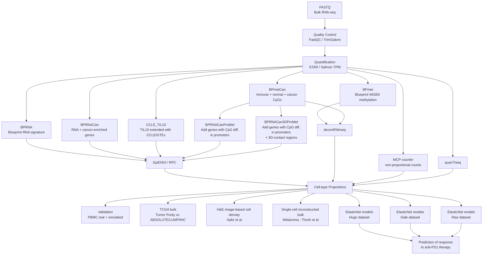

# GEM-DeCan — Methodological Contributions

This section describes the methodological work I performed on the GEM-DeCan project, focusing on the reproducibility, validation, and biological coherence of the multi-omics pipeline used to generate and evaluate the GEM-DeCan signatures.

---

## 🔧 1. Pipeline Audit, Standardization and Documentation (Snakemake)

### Comprehensive pipeline audit
- Inspected all Snakemake rules (inputs, outputs, wildcards, DAG).
- Corrected missing or inconsistent dependencies.
- Standardized folder structure and naming conventions across all workflow steps.
- Identified and removed orphan or redundant rules.

### Reproducible environments
- Created and harmonized conda environments for each module (QC, alignment, quantification, deconvolution).
- Locked tool versions for full end-to-end reproducibility (FastQC, TrimGalore, STAR, Salmon, EpiDISH, deconRNAseq, quanTIseq, MCP-counter).
- Ensured cross-platform compatibility.

### Documentation
- Wrote detailed workflow documentation:
  - step-by-step description of each rule,
  - configuration parameters,
  - execution examples,
  - schema of the full pipeline from FASTQ to cell-type proportions.

---

## 🧮 2. Validation of Deconvolution Modules

### EpiDISH / RPC
- Verified correct loading of BPmet and BPmetCan methylation signatures.
- Checked CpG/group matching and format consistency.
- Validated estimates on PBMC mixtures (simulated and real).

### deconRNAseq
- Evaluated BPRNA, BPRNACan, and CCLE_TIL10 signatures.
- Verified mixture reconstruction stability and positivity constraints.
- Tested performance on in silico mixtures.

### MCP-counter & quanTIseq
- Ensured correct mapping between signature genes and sample matrices.
- Verified output structure, reproducibility, and score interpretation.

### Immunotherapy prediction module
- Checked consistency of generated matrices (proportions → model input).
- Verified train/test splits, seeds, and feature alignment.

---

## 🧬 3. Transcription Factor Activity Analysis

### Data preparation
- Generated expression matrices (TPM / logTPM) compatible with TF activity inference.
- Harmonized gene naming conventions and filtered relevant gene sets.

### TF activity inference
- Computed regulatory activity for TFs associated with:
  - M1 macrophages (IRF1, IRF5, STAT1, NFκB),
  - M2 macrophages (STAT6, PPARγ, C/EBPβ),
  - T/NK/B-cell programs (T-bet, BATF, Eomes, NFAT).

### Biological validation
- Confirmed biological coherence between inferred cell-type proportions and TF activation patterns.
- Demonstrated improved macrophage M1/M2 discrimination when using signatures augmented by methylation and Hi-C (BPRNACanProMet, BPRNACan3DProMet).
- Identified and documented discordances for quality control and further model refinement.

---

## 📊 4. End-to-End Quality Control

- Ran complete FASTQ → deconvolution tests on:
  - PBMC (public datasets),
  - TCGA bulk samples,
  - in silico mixtures.
- Verified consistency across deconvolution methods (EpiDISH, deconRNAseq, MCP-counter, quanTIseq).
- Checked purity estimates against reference methods (ABSOLUTE, LUMP, IHC, ESTIMATE).
- Ensured stability of signatures across datasets and species.

---

## ✔ Summary

My work ensured that GEM-DeCan is:
- fully reproducible (Snakemake, conda, version control),
- biologically coherent (TF activity validation),
- technically robust (QC on all modules and datasets),
- suitable for external users and reviewers.

