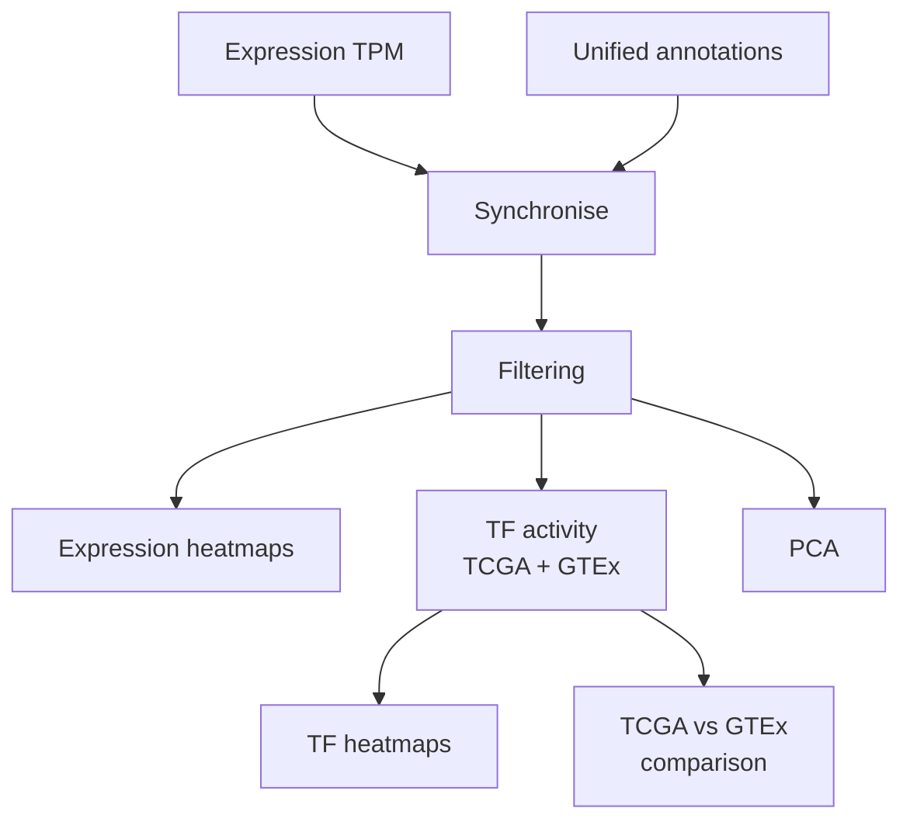

# LungPredict — TF Analysis Pipeline

This directory provides a structured and reproducible workflow for transcriptional and transcription factor (TF) activity analysis in the LungPredict cohort.

The pipeline integrates:
- unified annotations,
- expression (TPM),
- expression-based and pathway-based clusters,
- TF activity inference with DoRothEA + viper,
- annotated heatmaps,
- TCGA vs GTEx comparison,
- PCA.
---

## 1. Directory Layout

```

TF_analysis/
├── data/
│   ├── LP_FFPE_STAR_RSEM_TPM.txt
│   ├── clinic_data_v2_clean.csv
│   ├── ReactomeClustersAllPatients.csv
│   ├── DeconvCancerClusters.txt
│   ├── expression_based_patient_clusters_resCutCorrected.txt
│   └── full_annotations_with_clusters_corrected1.txt
│
├── scripts/
│   ├── lungpredict_tf_pipeline.R
│   ├── utils_logging.R
│   ├── utils_annotations.R
│   ├── utils_heatmaps.R
│   └── utils_tf_activity.R
│
├── results/
│   ├── heatmaps_expression/
│   ├── heatmaps_TF/
│   ├── comparisons_tcga_gtex/
│   ├── pca/
│   └── logs/
│
└── README.md

````

---

## 2. Input Data

| File                                                  | Description                          |
|-------------------------------------------------------|--------------------------------------|
| `LP_FFPE_STAR_RSEM_TPM.txt`                           | Expression matrix (TPM)              |
| `clinic_data_v2_clean.csv`                            | Clinical + mutational annotations    |
| `ReactomeClustersAllPatients.csv`                     | Reactome-based clusters              |
| `DeconvCancerClusters.txt`                            | Deconvolution-based clusters         |
| `expression_based_patient_clusters_resCutCorrected.txt` | Final expression clusters          |
| `full_annotations_with_clusters_corrected1.txt`       | Final unified annotation table       |

---

## 3. Workflow Overview

1. Load expression and unified annotations  
2. Synchronise samples  
3. Optional clinical filtering  
4. Expression heatmaps + correlation  
5. TF activity inference (DoRothEA TCGA & GTEx)  
6. TF heatmaps + variance filtering  
7. TCGA vs GTEx comparison  
8. PCA  

---

## 4. Pipeline Diagram



---

## 5. Running the Pipeline (RStudio)

Set the working directory to `TF_analysis/`:

```r
source("scripts/lungpredict_tf_pipeline.R")
```

Everything will run end-to-end:

* expression heatmaps
* TF activities (TCGA + GTEx)
* TF visualisations
* regulon comparisons
* PCA
* logs

All outputs are written under `results/`.

---

## 6. Script Overview

### `scripts/lungpredict_tf_pipeline.R`

Main orchestrator:

* defines paths
* loads utilities
* executes the complete workflow

### `scripts/utils_logging.R`

Light logging system:

* `init_logger()`
* `info_print()`
* `debug_print()`

### `scripts/utils_annotations.R`

Handles:

* annotation loading
* sample synchronisation
* clinical filtering
* mutation flags
* age categorisation

### `scripts/utils_heatmaps.R`

Creates publication-ready heatmaps using ComplexHeatmap:

* gene × patient
* patient × patient correlation
* TF × patient

### `scripts/utils_tf_activity.R`

Provides:

* TF activity estimation with viper
* regulon selection (A/B confidence)
* variance filtering
* TCGA vs GTEx comparison

---

## 7. Outputs (`results/`)

### Expression heatmaps

`results/heatmaps_expression/`

* `*_gene_by_patient.png`
* `*_patient_correlation.png`

### TF heatmaps

`results/heatmaps_TF/`

* TF × patient
* TF × patient (filtered)
* TF correlation

### TCGA–GTEx comparison

`results/comparisons_tcga_gtex/`

* patient correlation
* TF correlation
* difference matrices

### PCA

`results/pca/`

* scree plot
* PCA plots
* variance summary

### Logs

`results/logs/pipeline.log`

---

## 8. Dependencies

```r
install.packages(c("tidyverse","ComplexHeatmap","circlize","RColorBrewer","viridis"))
BiocManager::install(c("viper","dorothea","Hmisc"))
```
---


