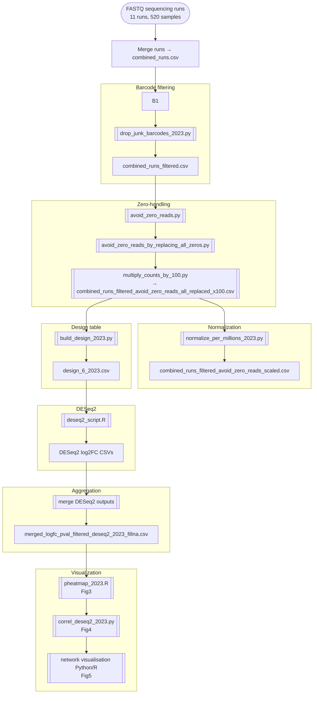

# **📘 Barcoding Drug Screen — Computational Pipeline**

## **Overview**

This repository reproduces the full computational workflow described in the “Barcoding computational analysis” section of the manuscript.
The pipeline processes 520 samples across 11 sequencing runs, filters barcodes, normalizes counts, performs differential abundance with DESeq2, and generates drug-response signatures (log2FC), correlation maps, and drug–drug similarity networks.

### **Main steps**

1. **Merge raw runs** into a single barcode × sample matrix.
2. **Filter unreliable barcodes** keep barcodes detected in **≥5 controls** and **≥5 time-zero samples.
3. **Handle zeros** (biological absences vs technical dropouts).
4. **Normalize** each sample to **1e6 reads** (CPM-like).
5. **Build design tables**.
6. **DESeq2** differential abundance.
7. **Construct log2FC signatures**.
8. **Perform visualization**: heatmaps, correlations, networks.
9. **Notebook** with all Figures (3–5).

---

# **1. Preprocessing & Barcode Filtering**

```bash
python scripts/01_preprocess_barcodes.py \
  --input_dir data/raw \
  --pattern "Run*.csv" \
  --output_prefix data/processed/barcodes \
  --min_reads 1 \
  --min_controls 5 \
  --min_timezeros 5
```

➡️ Script:
**[`scripts/01_preprocess_barcodes.py`](scripts/01_preprocess_barcodes.py)**

**Outputs**

* `data/processed/barcodes_combined_raw_counts.csv`
* `data/processed/barcodes_filtered_counts.csv`
* `data/processed/barcodes_filtered_cpm.csv`

---

# **2. QC of Controls**

```bash
python scripts/02_qc_controls_variability.py \
  --counts data/processed/barcodes_filtered_counts.csv \
  --output_prefix results/qc_controls/controls_variability
```

➡️ Script:
**[`scripts/02_qc_controls_variability.py`](scripts/02_qc_controls_variability.py)**

**Outputs**

* `controls_variability_per_barcode.tsv`
* `controls_variability_violin.png`

---

# **3. DESeq2 Inputs (Counts + Design)**

```bash
python scripts/03_build_deseq2_inputs.py \
  --counts data/processed/barcodes_filtered_counts.csv \
  --output_dir results/deseq2_inputs
```

➡️ Script:
**[`scripts/03_build_deseq2_inputs.py`](scripts/03_build_deseq2_inputs.py)**

**Outputs**

* `counts_for_deseq2.tsv`
* `design_for_deseq2.tsv`

---

# **4. Differential Abundance (DESeq2)**

Run:

```r
source("scripts/deseq2_script.R")
```

➡️ Script:
**[`scripts/deseq2_script.R`](scripts/deseq2_script.R)**

This script:

* loads counts + design
* runs DESeq2 (global or per-experiment)
* performs log2FC shrinkage (apeglm)
* outputs one CSV per condition

DESeq2 outputs go to:

`results/deseq2/`

---

# **5. Merge DESeq2 Outputs & Build Signatures**

```bash
python scripts/04_correlations_and_networks.py \
  --deseq2_dir results/deseq2 \
  --pattern "*.csv" \
  --output_prefix results/networks/drug_signatures \
  --corr_threshold 0.8
```

➡️ Script:
**[`scripts/04_correlations_and_networks.py`](scripts/04_correlations_and_networks.py)**

**Outputs**

* `drug_signatures_logfc_matrix.csv`
* `drug_signatures_correlation_matrix.csv`
* `drug_signatures_correlation_heatmap.png`
* `drug_signatures_network.png`

(Corresponds to **Figures 3, 4, and 5**.)

---

# **6. Notebook Visualization**

* **[`notebooks/01_visualize_barcode_signatures.ipynb`](notebooks/01_visualize_barcode_signatures.ipynb)**
  → reproduces Figures 3–5

Additional figure regeneration script:

* **[`scripts/05_generate_figures_for_paper.py`](scripts/05_generate_figures_for_paper.py)**

---

# **7. Pipeline Flowchart**



---

# **8. File / Script Index (Clickable)**

### **Python scripts**

* [`scripts/01_preprocess_barcodes.py`](scripts/01_preprocess_barcodes.py)
* [`scripts/02_qc_controls_variability.py`](scripts/02_qc_controls_variability.py)
* [`scripts/03_build_deseq2_inputs.py`](scripts/03_build_deseq2_inputs.py)
* [`scripts/04_correlations_and_networks.py`](scripts/04_correlations_and_networks.py)
* [`scripts/05_generate_figures_for_paper.py`](scripts/05_generate_figures_for_paper.py)

---

### **R scripts**

* [`scripts/deseq2_script.R`](scripts/deseq2_script.R)
* [`scripts/pheatmap_2023.R`](scripts/pheatmap_2023.R)

---

### **Notebooks**

* [`notebooks/01_visualize_barcode_signatures.ipynb`](notebooks/01_visualize_barcode_signatures.ipynb)

---

