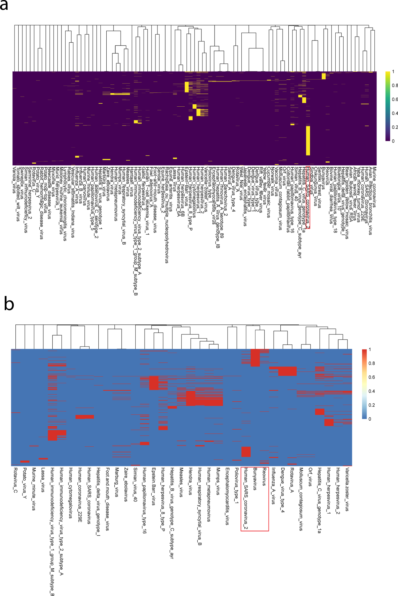

# Systemic Effects of SARS-CoV-2 on Host Cellular Functions

**Affiliation:** INSERM U1037 – Centre de Recherches en Cancérologie de Toulouse (CRCT)  
**Period:** 2020–2021  
**Publication:** [Communications Physics, Nature, 2021](https://www.nature.com/articles/s42005-021-00582-8)  

---

## 🧭 Context
SARS-CoV-2 infection perturbs multiple cellular processes beyond its primary respiratory targets.  
This collaborative project investigated the **system-wide impact** of viral proteins on host molecular networks to understand how infection reshapes fundamental biological functions.

The study combined **virus–host interactomics**, **transcriptomics**, and **functional enrichment** analyses to delineate the molecular footprint of COVID-19 at the cellular level.

---

## 🎯 Objectives
- Identify cellular pathways and biological processes disrupted by SARS-CoV-2 proteins.  
- Integrate host interaction data with transcriptomic responses to infection.  
- Quantify the extent of systemic perturbation across tissues and molecular functions.  

---

## 🧪 Methods
- **Data integration:** Protein–protein interaction data from mass spectrometry and curated databases.  
- **Functional enrichment:** Gene Ontology and Reactome analyses to map perturbed biological processes.  
- **Network analysis:** Graph-based propagation of perturbation scores across molecular interaction networks.  
- **Validation:** Comparison with transcriptomic responses from infected cell lines and tissues.  

---

## 💡 Contributions
- Performed large-scale functional enrichment analyses of viral–host interaction datasets.  
- Quantified pathway-level perturbations to identify globally affected cellular functions.  
- Contributed to the visualization of systemic functional disruption and cross-tissue comparisons.  
- Participated in the interpretation of network propagation results and manuscript preparation.  

---

## 📘 Key Skills
Functional genomics · Network propagation · Enrichment analysis · Multi-omics integration · Systems biology  

---

## 🔗 Reference
*Verstraete N.*, et al. *Systemic Cellular Perturbations Induced by SARS-CoV-2 Proteins across Host Pathways.*  
*Communications Physics (Nature)*, 2021. [DOI:10.1038/s42005-021-00582-8](https://www.nature.com/articles/s42005-021-00582-8)

## FIGURES

Fig. 5: Clustering analysis based on the viruses’ first range human protein targets and their related enriched Reactome pathways.

Fig. 6: Clustering analysis based on the viruses’ first and second-range human protein targets and their related Gene Ontology biological processes.

Viruses are clustered based on their (a) shared human protein direct targets (first range interactors) and (b) the enriched Reactome pathways containing these proteins. Binary distance has been used to perform the hierarchical clustering in all subplots. Red boxes highlight the cluster containing SARS-CoV-2. Enrichment analyses were performed with the R package clusterProfiler50 with a cutoff of p value <0.005. Viruses for which we could not find any enriched Reactome pathway do not appear on the enrichment heatmaps. Complete results of these enrichment analyses are available as Supplementary material (Supplementary Data 1 and 2).

Viruses are clustered based on their (a) shared human protein targets including direct and secondary interactors and (b) the enriched biological processes (Gene Ontology) containing these direct and secondary targets. Binary distance has been used to perform the hierarchical clustering in all subplots. Red boxes highlight the cluster containing SARS-CoV-2. Enrichment analyses were performed with the R package clusterProfiler50 with a cutoff of p value <0.005. Viruses for which we could not find any enriched GO biological process do not appear on the enrichment heatmaps. Complete results of these enrichment analyses are available as Supplementary Data 3 and 4.

 

