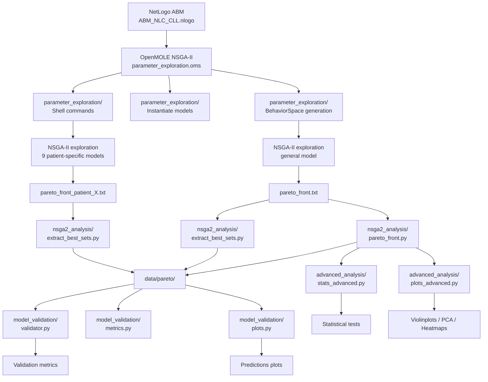

# Modeling Tumor Ecosystem Dynamics

**Affiliation:** INSERM U1037 – Centre de Recherches en Cancérologie de Toulouse (CRCT)  
**Period:** 2020–2023  
**Supervisor:** Vera Pancaldi  
**Publication:** Verstraete N., et al. *Modeling of Tumor Ecosystem Dynamics Reveals Coexistence Scenarios in Cancer-Immune Interactions.*  
*iScience*, 2023. [DOI:10.1016/j.isci.2023.106897](https://www.cell.com/iscience/fulltext/S2589-0042(23)00974-4)
 
For a more detailed description of the pipeline here, see here : [CV/04_Postdoc_INSERM/01_AgentBasedModel/README.md](README_DETAILS.md)

---

## Context
This project aimed to simulate tumor evolution as a small-scale ecosystem, to understand how tumor cells, immune cells, and their microenvironment interact dynamically over time.  

The goal was to capture emergent behaviors (coexistence, suppression, escape) resulting from local cellular interactions and environmental constraints.

---

## Objectives
- Develop an **agent-based model (ABM)** of tumor–immune cell interactions.  
- Explore how immune surveillance and microenvironmental factors affect tumor growth.  
- Use large-scale simulation experiments to identify stable and unstable equilibria.

---

## Methods
- **Modeling environment:** NetLogo  
- **Simulation platform:** OpenMOLE (for high-throughput experiments)  
- **Design:** Each agent represents a cell type (tumor, macrophage, T/NK, stroma) with defined behaviors and communication rules.  
- **Dynamics:** Spatial diffusion of signaling molecules and cellular transitions based on probabilistic rules.  
- **Analysis:** Aggregation of simulation outputs using R/Python (time-series clustering, population ratios, stability mapping).

---
## Flowchart diagram

## Contributions
- Designed and implemented the NetLogo model of the tumor ecosystem.  
- Automated hundreds of simulations with OpenMOLE for parameter space exploration.  
- Integrated visualization tools for dynamic behaviors and equilibrium states.  
- Contributed to interpretation and figure preparation for the publication.  

---

## Contact & Citation

If you use this pipeline or model, please cite the associated scientific publication and/or this repository.
**Publication:** Verstraete N., et al. *Modeling of Tumor Ecosystem Dynamics Reveals Coexistence Scenarios in Cancer-Immune Interactions.*  
*iScience*, 2023. [DOI:10.1016/j.isci.2023.106897](https://www.cell.com/iscience/fulltext/S2589-0042(23)00974-4)
---

For a more detailed description of the pipeline here, see here :   [CV/04_Postdoc_INSERM/01_AgentBasedModel/README.md](README_DETAILS.md)

