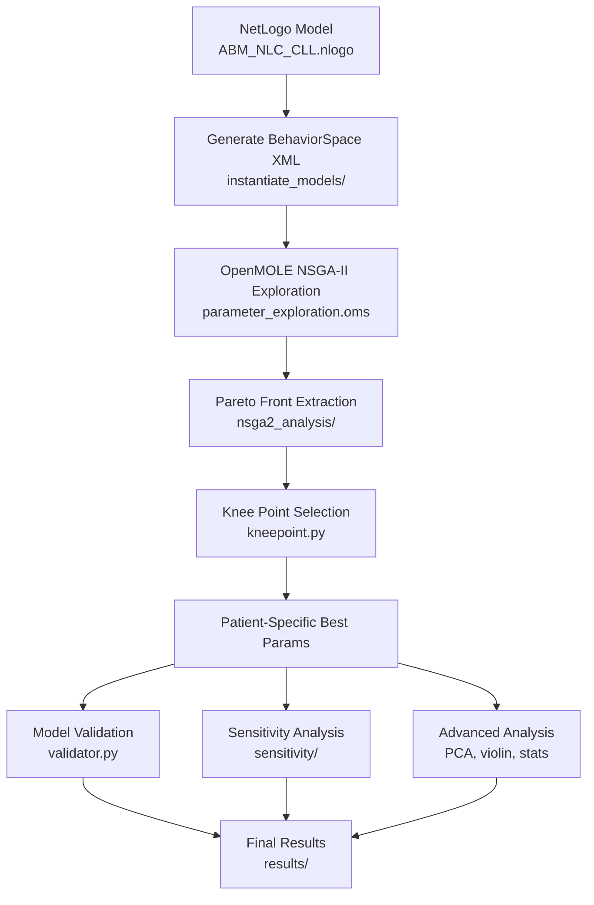

# 1. **Tumor Ecosystem Agent-Based Model (CLL–NLC)**

### *Computational pipeline: NetLogo → OpenMOLE (NSGA-II) → Python validation & advanced analysis*

This project models the **tumor ecosystem of chronic lymphocytic leukemia (CLL)**, focusing on interactions between **CLL tumor cells**, **Nurse-Like Cells (NLCs)**, and **microenvironmental signaling**. NLCs are activated monocyte-derived macrophages that emerge in the CLL microenvironment and promote tumor survival through cell–cell contact and soluble signals.

The ABM captures:

### **Cell types**

* **CLL cells**

  * proliferating or quiescent
  * depend on NLC proximity for survival
  * can migrate, aggregate, and form micro-clusters

* **Nurse-Like Cells (NLC)**

  * immobile or slowly migrating
  * secrete survival factors
  * form protective niches around CLL cells

### **Microenvironmental rules**

* Short-range attraction of CLL toward NLC
* Distance-dependent survival probability
* Stochastic proliferation & death
* Lifespan and recycling of NLC
* Optional diffusion fields (CXCL12 / BAFF) depending on configuration

### **Model outputs**

Each simulation produces:

* **CLL population dynamics**
* **NLC dynamics**
* **Spatial clustering metrics**
* **Distributions of distances CLL↔NLC**
* **Tumor growth curves**
* **Aggregate shapes and compactness**

These outputs are compared to:

* **experimental time-course data (per patient)**
* **single-cell imaging statistics**
* **bulk population measurements**

This ABM is used in a full **parameter exploration and calibration pipeline**, described below.

---

# 2. **Overview of the Computational Pipeline**

```
NetLogo model  →  BehaviorSpace (XML)  
 → OpenMOLE NSGA-II multi-objective optimization  
 → Pareto / knee point extraction  
 → Patient-specific model fitting  
 → Validation (RMSE, correlation)  
 → Sensitivity analysis  
 → Advanced analysis (PCA, violins, stats)
```

The goal is to identify **parameter sets** that simultaneously reproduce:

1. **CLL growth curves**,
2. **NLC temporal dynamics**,
3. **CLL–NLC spatial organization**,
   for both **general** and **patient-specific models**.

---

# 3. **Repository Architecture**

```
.
├── netlogo_model/
│   └── ABM_NLC_CLL.nlogo       ← biological model
│
├── openmole/
│   └── parameter_exploration.oms  ← NSGA-II workflow
│
├── abm_pipeline/
│   ├── cli.py                     ← command-line entrypoint
│   ├── config.py                  ← paths, parameters
│   │
│   ├── parameter_exploration/     ← exploration + NSGA-II analysis
│   │   ├── initial_ranges/
│   │   ├── instantiate_models/
│   │   ├── nsga2_analysis/
│   │   └── shell_commands/
│   │
│   ├── model_validation/          ← scoring + plots
│   │
│   ├── sensitivity/               ← 1-at-a-time sensitivity
│   │
│   └── advanced_analysis/         ← PCA, violin plots, statistics
│
├── data/
│   ├── experimental/              ← patient timecourse data
│   ├── pareto/                    ← extracted pareto sets
│   └── patient_dict.txt
│
├── results/
│   ├── behaviorspace/             ← general & patient simulations
│   ├── validation/                ← scoring, figures
│   └── advanced_analysis/
│
└── figures/
```

---

# 4. **Command-Line Interface (CLI)**

*(from `abm_pipeline/cli.py`)*

### **Generate BehaviorSpace XML files**

```
abm generate-behaviorspace --output openmole/
```

### **Produce shell commands for OpenMOLE**

```
abm make-commands --patient 1
```

### **Extract Pareto optimal sets**

```
abm extract-pareto --input results/behaviorspace/general_model/
```

### **Compute knee point**

```
abm kneepoint --pareto pareto_front.txt
```

### **Validate parameter sets**

```
abm validate --params data/pareto/best_model.json
```

### **Run sensitivity analysis**

```
abm sensitivity --params data/pareto/best_model.json
```

---

# 5. **Parameter Exploration Workflow**

```
flowchart TD
    subgraph Ranges[initial_ranges]
        R1[aggregate_data.py]
    end

    subgraph BehaviorSpace[instantiate_models]
        B1[behavior_space_files.py]
        B2[xml_behavior_space.py]
    end

    subgraph ShellCommands[shell_commands]
        SC1[patients.py]
        SC2[averaged.py]
        SC3[sensitivity.py]
        SC4[kneepoint.py]
    end

    subgraph NSGA[nsga2_analysis]
        N1[pareto_front.py]
        N2[extract_best_sets.py]
        N3[export_for_git.py]
    end

    R1 --> B1
    B1 --> B2
    B2 --> SC1
    SC1 --> NSGA
    SC2 --> NSGA
    SC3 --> NSGA
    SC4 --> NSGA
```

## 5.1. BehaviorSpace instantiation

The model parameters (around ~15 key parameters: proliferation, NLC attraction, death rates, spatial mobility…) have initial ranges defined under:

`abm_pipeline/parameter_exploration/initial_ranges/`

These ranges are used to generate **XML files** that specify full grid/latin-hypercube explorations.

## 5.2. OpenMOLE NSGA-II optimization

Workflow:

`openmole/parameter_exploration.oms`

Objectives include:

* **RMSE between simulated CLL curve and experimental data**
* **RMSE for NLC dynamics**
* **error on spatial clustering metrics**
* **diversity of solutions** (front spread)

Output per patient (9 patients):

```
results/behaviorspace/patient_specific_models/patient_X/
  ├── NSGAII_exploration_output_patient_X.txt
  └── pareto_front_patient_X.txt
```

---

# 6. **Pareto Analysis**

From `abm_pipeline/parameter_exploration/nsga2_analysis/`:

### **Extract fronts**

```
extract_best_sets.py
pareto_front.py
```

### **Knee point**

Definition: parameter set with maximal curvature on the Pareto surface.

```
kneepoint.py
```

Outputs:

* knee point params per patient
* summary table
* diagnostic plots (front + curvature)

---

# 7. **Model Validation**

Validation scripts (in `abm_pipeline/model_validation/`):

### **Metrics implemented**

* RMSE
* Pearson correlation
* Dynamic Time Warping (optional)
* Scaling-normalized errors
* Combined objective score

### **Validation command**

```
abm validate --patient 4 --params data/pareto/best_model_patient4.json
```

Outputs:

* simulated vs experimental curves
* scatter plots per timepoint
* model score summary

Plots go to:

`results/validation/`

---

# 8. **Sensitivity Analysis**

From `abm_pipeline/sensitivity/`:

* **1-at-a-time perturbations** (±5%, ±10%)
* effect on:

  * CLL growth
  * NLC dynamics
  * spatial measures

Outputs:

* tornado-style barplots
* violinplots of parameter influence

---

# 9. **Advanced Analysis**

From `abm_pipeline/advanced_analysis/`:

### **PCA on parameter sets**

* explore dimensionality of solution space
* identify dominant axes of variation

### **Violin plots**

* parameter distributions across patients
* class 1/2 clustering based on error patterns

### **Statistical tests**

* t-tests
* Mann–Whitney U
* permutation tests

Outputs saved under:

`results/advanced_analysis/`

---

# 10. **Mermaid Pipeline Diagram**



---

# 11. **Reproducibility**

To reproduce the entire workflow:

```
1. Install NetLogo ≥ 6.0
2. Install OpenMOLE ≥ 7
3. Python ≥ 3.10 with abm_pipeline
4. Place experimental data in data/experimental/
5. Run:
   abm generate-behaviorspace
   abm make-commands
   abm extract-pareto
   abm kneepoint
   abm validate
```

---

# 12. **Scientific & Technical Contributions**

* Built and calibrated a **full agent-based model** for CLL/NLC dynamics.
* Designed the **OpenMOLE NSGA-II multi-objective pipeline**.
* Automated patient-specific calibration for **9 patients**.
* Implemented **Python library `abm_pipeline`**:

  * behavior space generators
  * NSGA-II processing
  * pareto/knee extraction
  * validation metrics
  * plotting & advanced stats
* Performed **in-depth sensitivity analysis**.
* Designed the **entire figure pipeline** for publication-level outputs.
* Wrote **analysis notebooks**, **shell automation**, and **data management** tools.

---

## 13. Contact & Citation

If you use this pipeline or model, please cite the associated scientific publication and/or this repository.

Verstraete N., et al. *Modeling of Tumor Ecosystem Dynamics Reveals Coexistence Scenarios in Cancer-Immune Interactions.*  
*iScience*, 2023. [DOI:10.1016/j.isci.2023.106897](https://www.cell.com/iscience/fulltext/S2589-0042(23)00974-4)

---