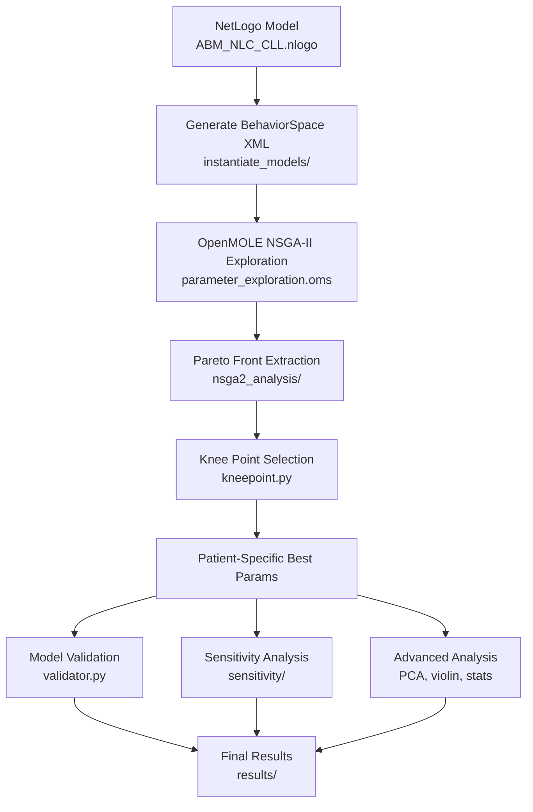
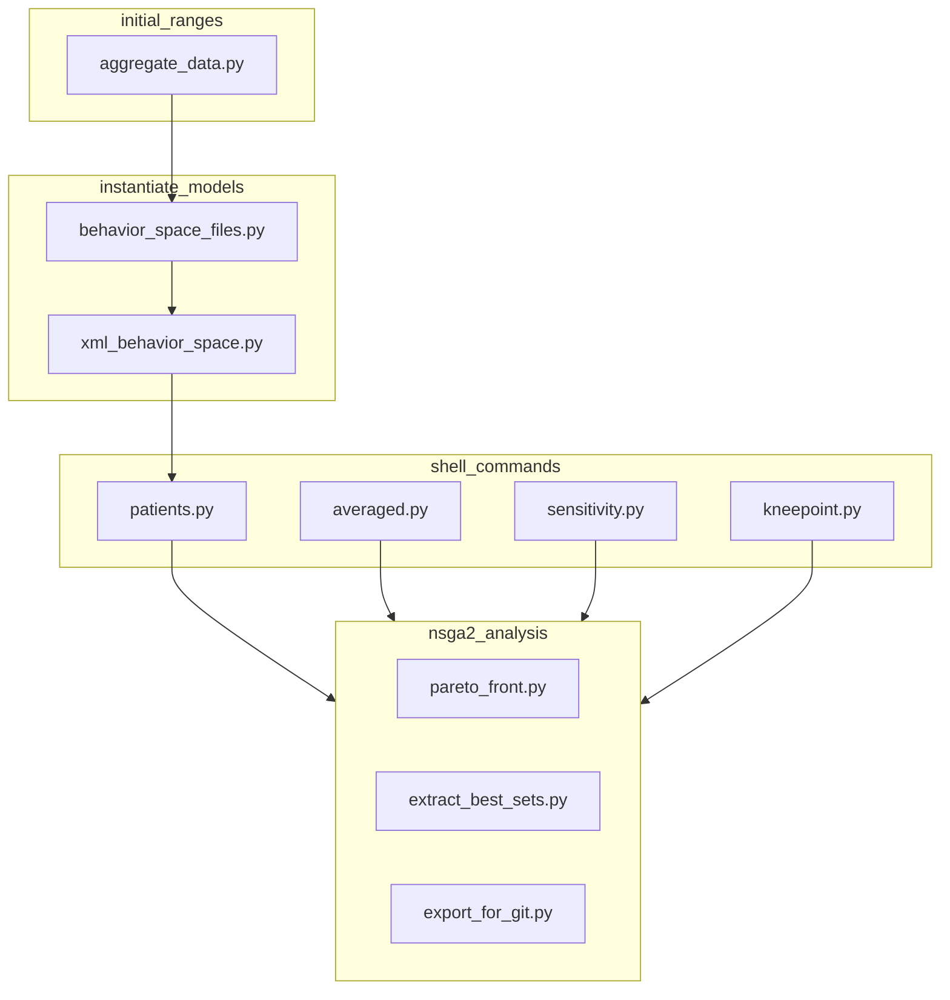

# **Computational Pipeline Overview**

### *NetLogo Agent-Based Model → OpenMOLE NSGA-II Optimization → Python Validation & Analysis*

This repository implements the full computational workflow described in
**Verstraete et al., *iScience* (2023)**, which reconstructs and calibrates a mechanistic **agent-based model (ABM)** of the *in-vitro* ecosystem formed by chronic lymphocytic leukemia (CLL) cells and monocyte-derived myeloid cells.
The overarching goal is to mechanistically reproduce:

* the **differentiation trajectory** monocyte → macrophage → Nurse-Like Cell (NLC),
* the **pro-survival interactions** between NLCs and CLL cells,
* the **population-level dynamics** observed in autologous PBMC cultures and heterologous co-culture experiments.

The pipeline integrates three major components:

1. **A NetLogo ABM** representing the spatial and temporal evolution of CLL and myeloid cells.
2. **A large-scale parameter exploration and multi-objective optimization** performed via **OpenMOLE** using the NSGA-II genetic algorithm.
3. **A suite of Python analysis modules**, providing quantitative validation, patient-specific refinements, and advanced statistical analyses.

---

## **Biological System Modeled**

The ABM recapitulates the two experimental platforms used in the study:

* **Autologous PBMC cultures** (13-day time course) in which monocytes naturally differentiate into macrophages and subsequently NLCs, while supporting CLL survival.
* **Heterologous co-cultures** combining patient-derived CLL B cells with healthy-donor monocytes, isolating cell–cell mechanisms without patient-specific myeloid differentiation differences.

These systems exhibit characteristic behaviors:

* emergence of NLCs over time,
* progressive reduction in apoptotic cell load (efferocytosis),
* chemotactic organization of CLL cells around NLCs,
* viability and concentration dynamics reproducible across patients.

---

## **Agent-Based Model (NetLogo)**

The model follows the mechanistic rules presented in the article (Figure 2), including:

### **Cell types and internal states**

**CLL cells (3 states):**

* *NeedSignal* (alive and dependent on proximity to NLCs),
* *Apoptotic*,
* *Dead*.

**Myeloid cells (3 states):**

* *Monocyte*,
* *Macrophage*,
* *NLC*.

### **Spatial and temporal structure**

* 2D lattice approximating the scale of CLL cells (~5 µm per patch).
* At most one cell per patch.
* Movement restricted to neighboring empty patches.
* Time step = **1 hour**, total duration = **13 days**.

### **Processes captured**

* short-range attraction of CLL cells toward NLCs,
* state transitions driven by contact, thresholds and time scales,
* macrophage and NLC phagocytic activity toward apoptotic/dead cells,
* stochasticity in movement, transitions, and death events.

These processes allow the ABM to generate **viability**, **concentration**, **spatial organization**, and **efferocytosis** dynamics that can be compared to experimental data.

---

## **Parameter Exploration and Model Calibration (OpenMOLE, NSGA-II)**

The NetLogo model contains **19 free parameters** associated with:

* differentiation time scales,
* sensing/interaction distances,
* probabilities of apoptosis,
* efferocytosis efficiencies,
* NLC induction thresholds,
* survival effects mediated by NLCs.

As in the paper, parameter exploration is performed using **OpenMOLE**:

* **≈20,000 simulations** are run across the 19-dimensional parameter space.
* Optimization follows **NSGA-II**, simultaneously fitting:

  * **CLL viability**, and
  * **CLL concentration**
    measured in patient-derived time-course datasets.

### **Pareto front and parameter selection**

Following the article’s methodology:

1. Only parameter sets simulated **≥50 times** are retained.
2. These sets form a multi-objective **Pareto front**.
3. Three representative solutions are extracted:

   * best for viability,
   * best for concentration,
   * the **knee-point**, representing the most balanced fit.

The **knee-point model** is selected as the main calibrated model due to its balanced accuracy across both experimental readouts.

---

## 📊 **Python Post-Processing and Validation**

After optimization, downstream quantitative analysis is performed using Python:

### **1. Experimental validation**

For each of the **9 autologous CLL patients**, the calibrated model is compared against measured:

* viability curves,
* concentration dynamics,
* apoptotic/dead cell fractions.

The following metrics are computed:

* **NRMSE**,
* **R²**,
* residual diagnostics,
* model vs. experimental trajectory overlays.

### **2. Patient-specific models**

Heterologous co-culture experiments allow per-patient refinement:

* NSGA-II is re-run per patient,
* patient-specific Pareto fronts are extracted,
* knee-points are determined automatically,
* selected parameter sets are compared across patients.

### **3. Global and local sensitivity analysis**

Python modules compute:

* one-parameter perturbation effects,
* multi-parameter PCA,
* distributions of optimal parameter sets (violin plots),
* parameter influence rankings.

Together, these analyses quantify which biological processes exert the strongest control over CLL survival and myeloid differentiation outcomes.

---


# **Overview of the Computational Pipeline**

```
NetLogo model  →  BehaviorSpace (XML)  
 → OpenMOLE NSGA-II multi-objective optimization  
 → Pareto / knee point extraction  
 → Patient-specific model fitting  
 → Validation (RMSE, correlation)  
 → Sensitivity analysis  
 → Advanced analysis (PCA, violins, stats)
```

The goal is to identify **parameter sets** that simultaneously reproduce:

1. **CLL growth curves**,
2. **NLC temporal dynamics**,
   for both **general** and **patient-specific models**.

---

## **Repository Architecture**

```
.
├── netlogo_model/
│   └── ABM_NLC_CLL.nlogo       ← biological model
│
├── openmole/
│   └── parameter_exploration.oms  ← NSGA-II workflow
│
├── abm_pipeline/
│   ├── cli.py                     ← command-line entrypoint
│   ├── config.py                  ← paths, parameters
│   │
│   ├── parameter_exploration/     ← exploration + NSGA-II analysis
│   │   ├── initial_ranges/
│   │   ├── instantiate_models/
│   │   ├── nsga2_analysis/
│   │   └── shell_commands/
│   │
│   ├── model_validation/          ← scoring + plots
│   │
│   ├── sensitivity/               ← 1-at-a-time sensitivity
│   │
│   └── advanced_analysis/         ← PCA, violin plots, statistics
│
├── data/
│   ├── experimental/              ← patient timecourse data
│   ├── pareto/                    ← extracted pareto sets
│   └── patient_dict.txt
│
├── results/
│   ├── behaviorspace/             ← general & patient simulations
│   ├── validation/                ← scoring, figures
│   └── advanced_analysis/
│
└── figures/
```

---

## **Pipeline Diagram**



*(from `abm_pipeline/cli.py`)*

### **Generate BehaviorSpace XML files**

```
abm generate-behaviorspace --output openmole/
```

### **Produce shell commands for OpenMOLE**

```
abm make-commands --patient 1
```

### **Extract Pareto optimal sets**

```
abm extract-pareto --input results/behaviorspace/general_model/
```

### **Compute knee point**

```
abm kneepoint --pareto pareto_front.txt
```

### **Validate parameter sets**

```
abm validate --params data/pareto/best_model.json
```

### **Run sensitivity analysis**

```
abm sensitivity --params data/pareto/best_model.json
```

---

### **Parameter Exploration Workflow**



#### BehaviorSpace instantiation

The model parameters (around ~20 key parameters: proliferation, NLC attraction, death rates, spatial mobility…) have initial ranges defined under:

`abm_pipeline/parameter_exploration/initial_ranges/`

These ranges are used to generate **XML files** that specify full grid/latin-hypercube explorations.

#### OpenMOLE NSGA-II optimization

Workflow:

`openmole/parameter_exploration.oms`

Objectives include:

* **RMSE between simulated CLL curve and experimental data**
* **RMSE for NLC dynamics**

Output per patient (9 patients):

```
results/behaviorspace/patient_specific_models/patient_X/
  ├── NSGAII_exploration_output_patient_X.txt
  └── pareto_front_patient_X.txt
```

---

### **Pareto Analysis**

From `abm_pipeline/parameter_exploration/nsga2_analysis/`:

#### **Extract fronts**

```
extract_best_sets.py
pareto_front.py
```

#### **Knee point**

Definition: parameter set with maximal curvature on the Pareto surface.

```
kneepoint.py
```

Outputs:

* knee point params per patient
* summary table
* diagnostic plots (front + curvature)

---

### **Model Validation**

Validation scripts (in `abm_pipeline/model_validation/`):

#### **Metrics implemented**

* RMSE
* Pearson correlation
* Combined objective score

#### **Validation command**

```
abm validate --patient 4 --params data/pareto/best_model_patient4.json
```

Outputs:

* simulated vs experimental curves
* scatter plots per timepoint
* model score summary

Plots go to:

`results/validation/`

---

### **Sensitivity Analysis**

From `abm_pipeline/sensitivity/`:

* **1-at-a-time perturbations** (±5%, ±10%)
* effect on:

  * CLL growth
  * NLC dynamics

Outputs:

* tornado-style barplots
* violinplots of parameter influence

---

### **Advanced Analysis**

From `abm_pipeline/advanced_analysis/`:

#### **PCA on parameter sets**

* explore dimensionality of solution space
* identify dominant axes of variation

#### **Violin plots**

* parameter distributions across patients
* class 1/2 clustering based on error patterns

#### **Statistical tests**

* t-tests
* Mann–Whitney U
* permutation tests

Outputs saved under:

`results/advanced_analysis/`

---

# **Reproducibility**

To reproduce the entire workflow:

```
1. Install NetLogo ≥ 6.0
2. Install OpenMOLE ≥ 7
3. Python ≥ 3.10 with abm_pipeline
4. Place experimental data in data/experimental/
5. Run:
   abm generate-behaviorspace
   abm make-commands
   abm extract-pareto
   abm kneepoint
   abm validate
```

---

## **Scientific & Technical Contributions**

* Built and calibrated a **full agent-based model** for CLL/NLC dynamics.
* Designed the **OpenMOLE NSGA-II multi-objective pipeline**.
* Automated patient-specific calibration for **9 patients**.
* Implemented **Python library `abm_pipeline`**:

  * behavior space generators
  * NSGA-II processing
  * pareto/knee extraction
  * validation metrics
  * plotting & advanced stats
* Performed **in-depth sensitivity analysis**.
* Designed the **entire figure pipeline** for publication outputs.
  
---

## Contact & Citation

If you use this pipeline or model, please cite the associated scientific publication and/or this repository.

Verstraete N., et al. *Modeling of Tumor Ecosystem Dynamics Reveals Coexistence Scenarios in Cancer-Immune Interactions.*  
*iScience*, 2023. [DOI:10.1016/j.isci.2023.106897](https://www.cell.com/iscience/fulltext/S2589-0042(23)00974-4)


---


