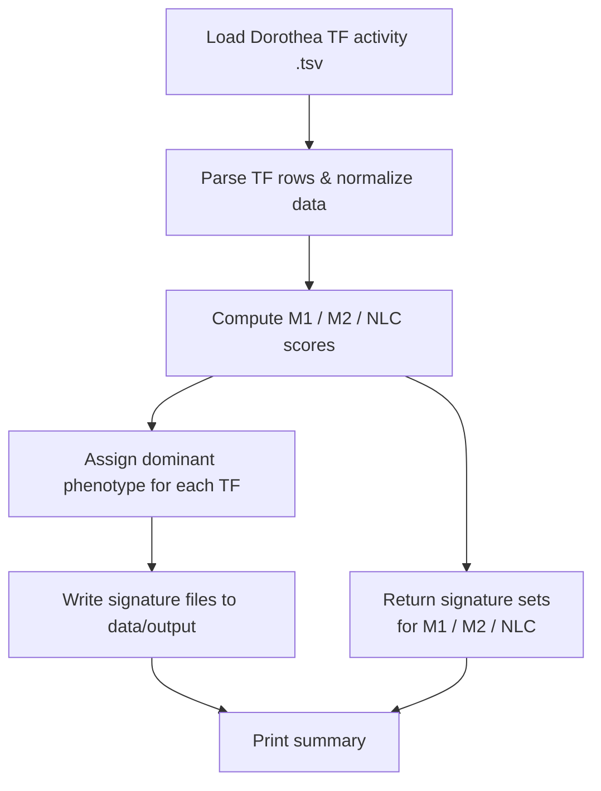

# Macrophage Polarization in CLL — TF Activity Signature Pipeline


**Affiliation:** INSERM U1037 – Centre de Recherches en Cancérologie de Toulouse (CRCT)  
**Period:** 2020–2023  
**Publication:** [Cancers, 2020](https://www.mdpi.com/2072-6694/12/12/3664)  

---
This repository contains the code and documentation developed during the INSERM/CRCT project on **macrophage polarization** in the context of **Chronic Lymphocytic Leukemia (CLL)**.
Macrophages in CLL’s tumor microenvironment can differentiate into **Nurse-Like Cells (NLCs)**, a tumor-supportive phenotype that promotes leukemic cell survival and immune escape.

This project implements a **modular Python pipeline** to extract and analyze transcription factor (TF) activity signatures (M1, M2, NLC) using **DoRothEA / VIPER** and explore their relevance to macrophage plasticity.

---

## Biological Background

Macrophage phenotypes are shaped by cytokines, transcription factors, and environmental cues:

* **M1 macrophages** → pro-inflammatory, anti-tumoral
* **M2 macrophages** → anti-inflammatory, tissue repair, immunoregulatory
* **NLCs (Nurse-Like Cells)** → CLL-associated macrophages with tumor-supportive functions

NLCs arise when CLL cells reprogram macrophages through:

* direct contact (e.g., CD40L, integrins)
* cytokines (IL-10, BAFF, APRIL)
* altered NF-κB / STAT3 / PI3K signaling

Understanding the **regulatory programs** driving these phenotypes requires both transcriptomic analysis and integrative modelling.

---

## Project Objectives

* Infer TF activities for macrophages exposed to CLL/TME cues.
* Classify TFs into dominant polarization programs (**M1**, **M2**, **NLC**).
* Export signature sets describing regulatory identities of each phenotype.

---

## Methods Overview

### **1. Input Data**

Scaled TF activity matrix generated from Dorothea / DoRothEA.

### **2. TF Signature Extraction**

For each TF, compute contributions to M1, M2, and NLC phenotypes, then assign the dominant signature.

### **3. Output**

* Signature files for **M1**, **M2**, **NLC**
* Summary table
* Python objects for downstream analysis
* Optional visualization via `notebook_pipeline.ipynb`

---

## 🗂 Repository Structure

```
02_BooleanModel/
│
├── README.md                  # (This file)
├── notebook_pipeline.ipynb    # Exploratory usage & visualization
├── run_pipeline.py            # CLI entry point
│
├── data/
│   ├── input/                 # Dorothea TF activity tables
│   └── output/                # Generated M1/M2/NLC signatures
│
└── src/
    ├── __init__.py
    ├── io.py                  # File loading / writing utilities
    ├── pipeline.py            # Core logic for TF signature extraction
    ├── signatures.py          # Scoring & signature attribution
    └── utils.py               # Timer & miscellaneous helpers
```

---

## Pipeline Diagram



---

## Usage

### Full pipeline

```bash
python run_pipeline.py
```

### Specific step only

```bash
python run_pipeline.py --step signatures
```

Results appear in:

```
data/output/
```

---

## Interpretation of Outputs

The pipeline yields:

* **NLC-associated TFs**
  → often linked to STAT3, PI3K/AKT, NF-κB, immunosuppression, CLL-support functions.

* **M1-associated TFs**
  → STAT1, IRF1/7, NF-κB-driven inflammatory axis.

* **M2-associated TFs**
  → C/EBPβ, PPARγ, KLF4, homeostatic anti-inflammatory regulators.

Comparing these signatures helps identify transcriptional routes by which CLL cells reprogram macrophages.

---

## Reference
Marku M., *Verstraete N.*, et al. *Insights on TAM Formation from a Boolean Model of Macrophage Polarization Based on In Vitro Studies.*  
*Cancers*, 2020. [DOI:10.3390/cancers12123664](https://www.mdpi.com/2072-6694/12/12/3664)


