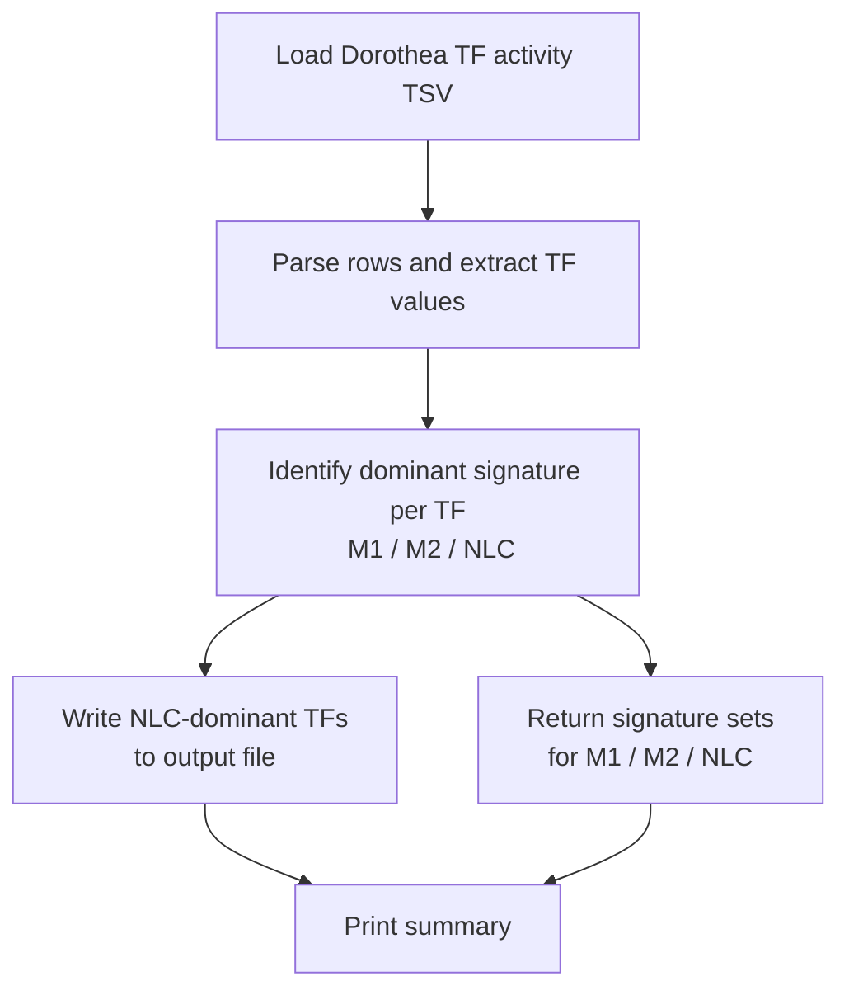

# Macrophage Polarization — Signature Extraction Pipeline

Modular Python pipeline for extracting transcription factor signatures (M1, M2, NLC) from Dorothea/DoRothEA-derived TF activity scores.

---

## 🧬 Pipeline Overview



---

## 🗂 Repository Structure

```
macrophage_polarization/
│
├── data/
│   ├── input/
│   │   └── Dorothea_TF_activity_scale.tsv
│   └── output/
│       └── scale_rescaled_output.txt
│
├── src/
│   ├── io.py
│   ├── signatures.py
│   ├── utils.py
│   └── pipeline.py
│
└── run_pipeline.py
```

---

## ▶️ Usage

Run the full pipeline:

```bash
python run_pipeline.py
```

Run only signature extraction:

```bash
python run_pipeline.py --step signatures
```

---

## 📘 Notes

* Compatible with Python ≥ 3.8
* Requires only built-in libraries
* Outputs are placed in `data/output/`

---
