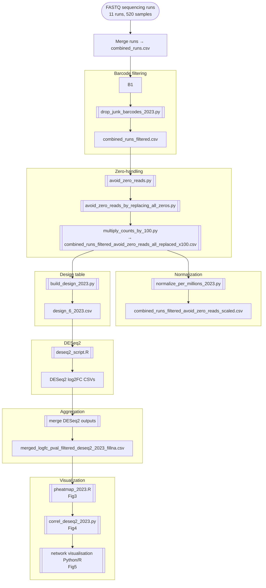

# **Barcoding Drug Screen - Computational Pipeline**

## **Overview**

This repository reproduces the full computational workflow described in the “Barcoding computational analysis” section of the manuscript.
The pipeline processes 520 samples across 11 sequencing runs, filters barcodes, normalizes counts, performs differential abundance with DESeq2, and generates drug-response signatures (log2FC), correlation maps, and drug–drug similarity networks.

### **Main steps**

1. **Merge raw runs** into a single barcode × sample matrix.
2. **Filter unreliable barcodes**

   * keep barcodes detected in **≥5 controls** and **≥5 time-zero samples**.
3. **Handle zeros** (biological absences vs. technical dropouts): replace technical zeros by a small offset (0.01).
4. **Normalize** each sample to a total of **1e6 reads** (CPM-like).
5. **Build design tables** (run, experiment, replicate, condition).
6. **DESeq2 analysis**

   * log2 fold changes (per condition vs control),
   * optional p-value filtering and shrinkage.
7. **Construct log2FC signatures** (conditions × barcodes).
8. **Downstream analyses**

   * heatmaps (drug clusters),
   * correlation matrix (drug–drug similarity),
   * drug similarity network (edges: Pearson ≥ 0.8).
9. **Notebook visualization** of Figures 3–5.

---

# **1. Preprocessing & Barcode Filtering**

```bash
python scripts/01_preprocess_barcodes.py \
  --input_dir data/raw \
  --pattern "*.csv" \
  --output_prefix data/processed/barcodes \
  --min_reads 1 \
  --min_controls 5 \
  --min_timezeros 5
```

➡️ Script:
**[`scripts/01_preprocess_barcodes.py`](scripts/01_preprocess_barcodes.py)**

**What this does**

* merges all runs into `combined_raw_counts.csv`
* removes barcodes absent from *≥5 control* and *≥5 time-zero* samples
* outputs filtered matrices

**Outputs**

* `data/processed/barcodes_combined_raw_counts.csv`
* `data/processed/barcodes_filtered_counts.csv`
* `data/processed/barcodes_filtered_cpm.csv`

---

# **2. QC of Controls**

```bash
python scripts/02_qc_controls_variability.py \
  --counts data/processed/barcodes_filtered_counts.csv \
  --output_prefix results/qc_controls/controls_variability
```

➡️ Script:
**[`scripts/02_qc_controls_variability.py`](scripts/02_qc_controls_variability.py)**

This computes barcode-level control stability:
[
\frac{\max - \min}{\text{mean}}
]

**Outputs**

* `controls_variability_per_barcode.tsv`
* `controls_variability_violin.png`

---

# **3. DESeq2 Inputs (Counts + Design)**

```bash
python scripts/03_build_deseq2_inputs.py \
  --counts data/processed/barcodes_filtered_counts.csv \
  --output_dir results/deseq2_inputs
```

➡️ Script:
**[`scripts/03_build_deseq2_inputs.py`](scripts/03_build_deseq2_inputs.py)**

**Outputs**

* `counts_for_deseq2.tsv`
* `design_for_deseq2.tsv`
   (columns: run, experiment, replicate, condition)
---

# **4. Differential Abundance (DESeq2)**

Run:

```r
"/i/Program Files/R/R-4.3.1/bin/x64/Rscript.exe" scripts/deseq2_differential_abundance.R
```

➡️ Script:
**[`scripts/deseq2_differential_abundance.R`](scripts/deseq2_differential_abundance.R)**

This script:

* loads counts + design
* runs DESeq2 with `design = ~ exp + condition` or per-experiment `~ condition`
* shrinks log2FC using **apeglm**
* exports one result CSV per condition


**All DESeq2 outputs should be saved in:**
`results/deseq2/`

---

# **5. Merge DESeq2 Outputs & Build Signatures**

```bash
python scripts/04_correlations_and_networks.py \
  --deseq2_dir results/deseq2 \
  --pattern "*.csv" \
  --output_prefix results/networks/drug_signatures \
  --corr_threshold 0.8
```

➡️ Script:
**[`scripts/04_correlations_and_networks.py`](scripts/04_correlations_and_networks.py)**

**Outputs**

* `drug_signatures_logfc_matrix.csv`
* `drug_signatures_correlation_matrix.csv`
* `drug_signatures_correlation_heatmap.png`
* `drug_signatures_network.png`

(Corresponds to **Figures 3, 4, and 5**.)

---

# **6. Notebook Visualization**

* **[`notebooks/01_visualize_barcode_signatures.ipynb`](notebooks/01_visualize_barcode_signatures.ipynb)**
  → reproduces Figures 3–5

Additional figure regeneration script:

* **[`scripts/05_generate_figures_for_paper.py`](scripts/05_generate_figures_for_paper.py)**

---

# **7. Pipeline Flowchart**


---

# **8. File / Script Index (Clickable)**

### **Python scripts**

* [`scripts/01_preprocess_barcodes.py`](scripts/01_preprocess_barcodes.py)
* [`scripts/02_qc_controls_variability.py`](scripts/02_qc_controls_variability.py)
* [`scripts/03_build_deseq2_inputs.py`](scripts/03_build_deseq2_inputs.py)
* [`scripts/04_correlations_and_networks.py`](scripts/04_correlations_and_networks.py)
* [`scripts/05_generate_figures_for_paper.py`](scripts/05_generate_figures_for_paper.py)

---

### **R scripts**

* [`scripts/deseq2_differential_abundance.R`](scripts/deseq2_differential_abundance.R)

---

### **Notebooks**

* [`notebooks/01_visualize_barcode_signatures.ipynb`](notebooks/01_visualize_barcode_signatures.ipynb)

---
